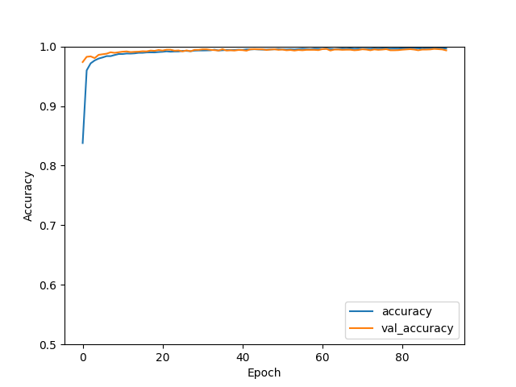

# KaggleDigitRecognizer
The solution of Digit Recognizer, image processing competition, from  Kaggle. The sysyem is able to predict the handwritten digit images with **99.4%** accuracy.

## Requirements
The list of the libraries that needed to be installed are:  
* **pandas**
* **tensorflow**
* **keras**
* **matplotlib**

## Modelling
The data is split into training and validation sets in a 0.9-0.1 ratio. To make the training process fast, pixel values are standardized by diving 255 (maximum RGB color value). Model built by using Keras's Sequential API. Two back to back Convolutional layers are followed by the MaxPooling layer. Then Dropout with 0.25 rate is used for regularization purposes. To reduce calculation cost, Batch Normalization is performed before ReLU activation and after Convolutional layers. In the end, two Fully Connected layers are used. In the last layer, the softmax activation function is used for outputs. Convolutional filters are in the size of 3x3 and for MaxPooling 'same' padding is used.

As an optimizer **adam** and **adamax** are tried and the latter is found to perform better. _Early stopping_ is configured into the model to avoid overtraining.

Figure 1. below shows that Train accuracy and Validation accuracy wiggles through the end of lines. In general, there is no huge gap between them, meaning the fit is good, but it does not improve much after a point. Luckily, with the help of _early stopping_, it chooses the point where the validation accuracy was highest.

  

 Figure 1. Train accuracy vs Validaiton accuracy by epoch.

  

## What else might be done?
The model is built within hours, and it is designed to be simple as possible to train in a short time. Thus, improvements can be done by training more than one NNs and building an ensemble model. Other than that, more complex CNN architectures can be formed and the training process can be extended, so that model can learn the data better. Better hypertuning can be done, for finding the best performing parameters. Lastly but most importantly, data augmentation can be done which will surely advance the model results drastically. It is a very useful approach to this kind of problem. I will try to apply this approach in the next version of code, however, I consider the resultant model simple but powerful system since it almost performs as good as the complex models available on the internet which use data augmentation and ensemble models.
